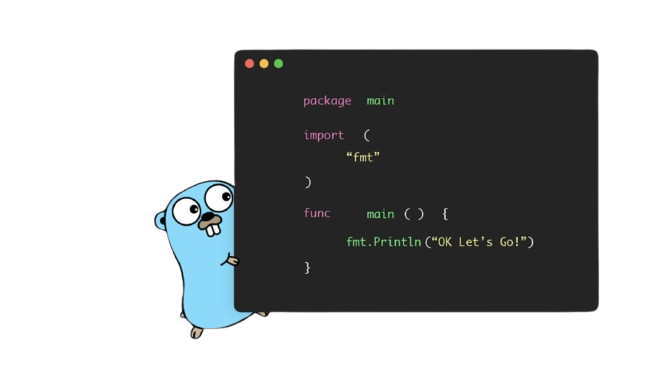

# Hello, World! I'm Israel! 👋

## About me

I am a **Computer Systems Engineering** student and passionate software developer. I love exploring new technologies and improving my skills in languages like **Go**, **Python**, **JavaScript**, and **Flutter**. 
My goal is to create efficient and scalable solutions to real-world problems—while having fun along the way.

I enjoy working on backend and mobile development, with experience in building interfaces, APIs, and data management.

### Mobile Development 📱
- Developing applications with **Flutter**, customizing interfaces and adapting them to different screen sizes.
  
### Backend and Databases 💻
- APIs built in **Go** and **Python**.
- Configuring servers on **Ubuntu** to handle large databases and respond to web requests.

### Web and Frontend Design 🌐
- Development with **HTML**, **CSS**, and **JavaScript** like the good old days. 
- Using good frameworks like React and Vue.

## In progress🚀

Here are some of the projects I'm working on:

- **Mobile applications with Flutter**: Developing advanced and responsive user interfaces.
- **Web server deployment**: Automating and configuring servers on Ubuntu for web response.

Feel free to contact me:

- 📫 **Email**: veyloirxgx@gmail.com
- 🌐 **LinkedIn**: 

This was editing at 21:54 by me, because of the master pako. 
